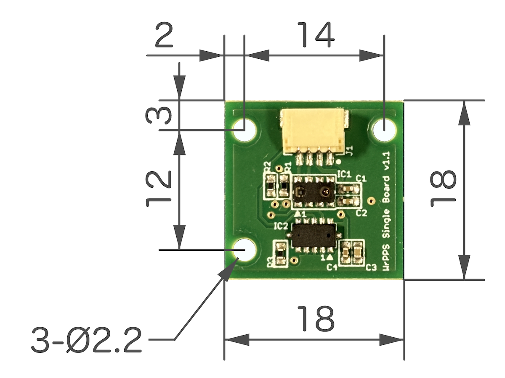

# wrpps_ros

ROS driver package for Wide-range Precise Proximity Sensor (WrPPS) board.  
Details of WrPPS are described in our paper: https://ieeexplore.ieee.org/document/9144379

Japanese papers:
- https://www.jstage.jst.go.jp/article/jsmermd/2019/0/2019_2P1-H08/_article/-char/ja/
- https://www.jstage.jst.go.jp/article/jsmermd/2020/0/2020_2A2-K15/_article/-char/ja/


## WrPPS Single Board

### Hardware

WrPPS Single Board has 2 type of proximity sensors.



- Dimensions
  - Width: 18 [mm]
  - Length: 18 [mm]
  - Height: 4.7 [mm]
- Weight: 1.5 [g]
- Sensors
  - Time-of-Flight (ToF) Ranging Sensor
    - VL53L0X - STMicroelectronics
      - https://www.st.com/ja/imaging-and-photonics-solutions/vl53l0x.html
      - Range: ≦ 2.0 [m]
  - Proximity and Ambient Light Sensor
    - VCNL4040 - VISHAY
      - https://www.vishay.com/ja/product/84274/
      - Range: ≦ 0.2 [m]
- Connector Socket
  - SH Connector
    - 4 pin
    - SM04B-SRSS-TB(LF)(SN) - JST
      - https://www.jst-mfg.com/product/index.php?series=231


### Connector Pin Asignment

The pin assignment follows the order 1-2-3-4 from the right side, as viewed in the image above, using either ● mark as a reference.

SH Connector<br> Pin No. | Arduino<br>UNO R4 MINIMA | Arduino<br>nano Every
:---: | :---: | :---:
1 | GND | GND
2 | 3.3V | 3.3V
3 | SDA | A4 (SDA)
4 | SCL | A5 (SCL)


### Arduino Boards

The following models of the Arduino series have been confirmed to work.

- Arduino UNO R4 MINIMA
- Arduino nano Every

<br>


## Installation

The installation outlines are shown as followings.

1. [Set up Arduino IDE](#set-up-arduino-ide)
2. [Run Arduino Post Install Script](#run-arduino-post-install-script)
3. [Clone and Build wrpps_ros and FA-I-sensor packages](#clone-and-build-wrpps_ros-and-fa-i-sensor-packages)
4. [Make rosserial Arduino Libraries](#make-rosserial-arduino-libraries)
5. [Upload WrPPS Sketch to Arduino](#upload-wrpps-sketch-to-arduino)


### Set up Arduino IDE

Download Arduino IDE software.

- Arduino - Software - Downloads
  - https://www.arduino.cc/en/software/
    - [Linux AppImage 64 bits (X86-64)](https://downloads.arduino.cc/arduino-ide/arduino-ide_2.3.6_Linux_64bit.AppImage)

``` bash
cd ~/Download
chmod a+x arduino-ide_2.3.6_Linux_64bit.AppImage
./arduino-ide_2.3.6_Linux_64bit.AppImage
```

Search and install "Adafruit_VL53L0X" on Library Manager of Arduino IDE.

> If you use R4 type Arduino boards, install Board Package.
> 
> - [Getting Started with Arduino UNO R4 Minima - ARDUINO DOCS](https://docs.arduino.cc/tutorials/uno-r4-minima/minima-getting-started/)
>   - https://docs.arduino.cc/tutorials/uno-r4-minima/minima-getting-started/

Ctrl-C to quit Arduino IDE for now.

### Run Arduino Post Install Script

Download a script and execute it.

- [ArduinoCore-mbed / post_install.sh - GitHub](https://github.com/arduino/ArduinoCore-mbed/blob/main/post_install.sh)
  - https://github.com/arduino/ArduinoCore-mbed/blob/main/post_install.sh

``` bash
cd ~/Download
chmod a+x post_install.sh
sudo ./post_install.sh 
```

### Clone and Build wrpps_ros and FA-I-sensor packages

``` bash
source /opt/ros/noetic/setup.bash
mkdir -p ~/wrpps_ws/src
cd ~/wrpps_ws/src
git clone https://github.com/tork-a/wrpps_ros.git
git clone https://github.com/RoboticMaterials/FA-I-sensor.git
cd ~/wrpps_ws
rosdep install -r -y --from-paths src --ignore-src
catkin build
source ~/wrpps_ws/devel/setup.bash
```

### Make rosserial Arduino Libraries

``` bash
sudo apt update
sudo apt install ros-noetic-rosserial-arduino
sudo apt install ros-noetic-rosserial
source ~/wrpps_ws/devel/setup.bash
cd ~/Arduino/libraries
rm -rf ros_lib
rosrun rosserial_arduino make_libraries.py .
```

### Upload WrPPS Sketch to Arduino

Upload WrPPS Sketch [wrpps_single_board_driver.ino](arduino/wrpps_single_board_driver/wrpps_single_board_driver.ino) to your Arduino.
The Sketch is included in `arduino / wrpps_sigle_board_driver` folder of this wrpps_ros package.

``` bash
source ~/wrpps_ws/devel/setup.bash
cd ~/Download
./arduino-ide_2.3.6_Linux_64bit.AppImage
```

1. Connect WrPPS Single Board to your Arduino (Vcc (3.3V), GND, SCL, and SDA)
2. Connect the Arduino to your PC
3. Choose your **Arduino** in the menu **Tools > Board:**
4. Choose a **Port** that your Arduino is connected in the menu **Tools > Port:**
5. Upload **wrpps_single_board_driver.ino** to your Arduino

Quit Arduino IDE.


## Usage

### Using Arduino to read WrPPS Single Board


```bash
roslaunch wrpps_ros wrpps_single_board.launch
```

If the connection port is not the default value of `/dev/ttyACM0`, argue the launch option and run it.

```bash
roslaunch wrpps_ros wrpps_single_board.launch port:=/dev/ttyUSB0
```

#### Launch Options of `wrpps_single_board.launch`

- sensor_name
  - default="wrpps_single_board
    - Sensor name of 
- rosserial_respawn
  - default="false"
    - rosserial respawn enable (true) or disable (false)
- port" 
  - default="/dev/ttyACM0"
    - Serial port for Arduino
- baud
  - default="115200"
    - Baud rate for the serial communication
- intensity_frame_id
  - default="$(arg sensor_name)_intensity_frame"
    - Frame ID for the intensity sensor frame
- tof_frame_id
  - default="$(arg sensor_name)_tof_frame"
    - Frame ID for the ToF sensor frame
- rate
  - default="40"
    - Rate of sensing [Hz]
<!--
- tof_field_of_view
  - default="0.44"
- tof_min_range
  - default="0.03"
- tof_max_range
  - default="2.0"
-->

#### Publishing topics

- `$(arg sensor_name)/driver/output/proximity_intensity` (`force_proximity_ros/ProximityStamped`)

  Intensity sensor value.

- `$(arg sensor_name)/driver/output/range_tof` (`sensor_msgs/Range`)

  ToF sensor value.

- `$(arg sensor_name)/intensity_model_acquisition/output/range_intensity` (`sensor_msgs/Range`)

  Range value converted from the intensity sensor. To get this value, call `set_init_intensity` service first.

- `$(arg sensor_name)/intensity_model_acquisition/output/range_combined` (`sensor_msgs/Range`)

  Range value generated with the combination of the intensity-based range value and the ToF range value (the close-range value comes from the intensity value and the long-range value comes from the ToF value).

#### Services

- `$(arg sensor_name)/intensity_model_acquisition/set_init_intensity` (`std_srvs/Empty`)

  Get initial value of the intensity sensor. Call this service when there is no object in front of the board. After calling this service, calibration of the intensity sensor with the ToF sensor starts. Once the calibration is completed, the range value converted from the intensity sensor becomes meaningful.

